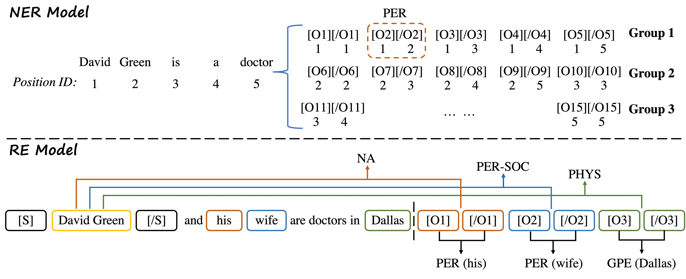

# PL-Marker
Source code of the ACL 2022 paper "[Packed Levitated Marker for Entity and Relation Extraction](https://arxiv.org/pdf/2109.06067.pdf)".

[@tomaarsen](https://github.com/tomaarsen) develops a feasible and powerful library, [SpanMarker](https://github.com/tomaarsen/SpanMarkerNER), to apply PL-Marker to named entity recognition. SpanMarker takes advantage of the valuable functionality of 🤗 [Transformers](https://github.com/huggingface/transformers/) library, thus it can deal with a series of NER datasets with various encoders. Thanks to [@tomaarsen](https://github.com/tomaarsen) for his insightful work!

## Quick links
* [Overview](#Overview)
* [Setup](#Setup)
  * [Install Dependencies](#Install-dependencies)
  * [Data Preprocessing](#Download-and-preprocess-the-datasets)
  * [Data Format](#Input-data-format)
  * [Trained Models](#Trained-Models)
* [Training Script](#Training-script)
* [Quick Start](#Quick-start)
* [CoNLL03 with Dev](#CoNLL03-with-dev)
* [Citation](#Citation)


## Overview


In this work, we present a novel span representation approach, named Packed Levitated Markers,  to consider the dependencies between the spans (pairs) by strategically packing the markers in the encoder. Our approach is evaluated on two typical span (pair) representation tasks:

1. Named Entity Recognition (NER): Adopt a group packing strategy for enabling our model to process massive spans together to consider their dependencies with limited resources.

2. Relation Extraction (RE): Adopt a subject-oriented packing strategy for packing each subject and all its objects into an instance to model the dependencies between the same-subject span pairs

Please find more details of this work in our paper.


## Setup
### Install Dependencies

The code is based on huggaface's [transformers](https://github.com/huggingface/transformers). 

Install dependencies and [apex](https://github.com/NVIDIA/apex):
```
pip3 install -r requirement.txt
pip3 install --editable ./transformers
```

### Download and preprocess the datasets
Our experiments are based on three datasets: ACE04, ACE05, and SciERC. Please find the links and pre-processing below:
* CoNLL03: We use the Enlish part of CoNLL03 from [Google Drive](https://drive.google.com/drive/folders/1ZxytgzPLTA7ge9sX-JgIoIZj7kUCdh9h?usp=sharing)/[Tsinghua Cloud](https://cloud.tsinghua.edu.cn/d/8885dca5b3b442e1834a/).
* OntoNotes: We use `preprocess_ontonotes.py`  to preprocess the [OntoNote 5.0](https://catalog.ldc.upenn.edu/LDC2013T19).
* Few-NERD: The dataseet can be downloaed in their [website](https://ningding97.github.io/fewnerd/)
* ACE04/ACE05: We use the preprocessing code from [DyGIE repo](https://github.com/luanyi/DyGIE/tree/master/preprocessing). Please follow the instructions to preprocess the ACE05 and ACE04 datasets.
* SciERC: The preprocessed SciERC dataset can be downloaded from [Google Drive](https://drive.google.com/drive/folders/1_u6pIe7Dw3Lqy4mF2m1UFqmKmGeM40zS?usp=sharing)/[Tsinghua Cloud](https://cloud.tsinghua.edu.cn/d/7dafc9a3d84d4151a755/).


### Input data format

The input data format for our models is JSONL. Each line of the input file contains one document in the following format.
```
{
  # document ID (please make sure doc_key can be used to identify a certain document)
  "doc_key": "CNN_ENG_20030306_083604.6",

  # sentences in the document, each sentence is a list of tokens
  "sentences": [
    [...],
    [...],
    ["tens", "of", "thousands", "of", "college", ...],
    ...
  ],

  # entities (boundaries and entity type) in each sentence
  "ner": [
    [...],
    [...],
    [[26, 26, "LOC"], [14, 14, "PER"], ...], #the boundary positions are indexed in the document level
    ...,
  ],

  # relations (two spans and relation type) in each sentence
  "relations": [
    [...],
    [...],
    [[14, 14, 10, 10, "ORG-AFF"], [14, 14, 12, 13, "ORG-AFF"], ...],
    ...
  ]
}
```

### Trained Models
We release our trained NER models and RE models on ACE05 and SciERC datasets on [Google Drive](https://drive.google.com/drive/folders/1k_Nt_DeKRKIRd2sM766j538b1JhYm4-H?usp=sharing)/[Tsinghua Cloud](https://cloud.tsinghua.edu.cn/d/5e4a117bc0e5407b9cee/). And we release our trained models on flat NER datasets on  [Tsinghua Cloud](https://cloud.tsinghua.edu.cn/d/5e4a117bc0e5407b9cee/).

*Note*: the performance of the models might be slightly different from the reported numbers in the paper, since we reported the average numbers based on multiple runs.

## Training Script
Download Pre-trained Language Models from [Hugging Face](https://huggingface.co/): 
```
mkdir -p bert_models/bert-base-uncased
wget -P bert_models/bert-base-uncased https://huggingface.co/bert-base-uncased/resolve/main/pytorch_model.bin
wget -P bert_models/bert-base-uncased https://huggingface.co/bert-base-uncased/resolve/main/vocab.txt
wget -P bert_models/bert-base-uncased https://huggingface.co/bert-base-uncased/resolve/main/config.json

mkdir -p bert_models/roberta-large
wget -P bert_models/roberta-large https://huggingface.co/roberta-large/resolve/main/pytorch_model.bin
wget -P bert_models/roberta-large https://huggingface.co/roberta-large/resolve/main/merges.txt
wget -P bert_models/roberta-large https://huggingface.co/roberta-large/resolve/main/vocab.json
wget -P bert_models/roberta-large https://huggingface.co/roberta-large/resolve/main/config.json

mkdir -p bert_models/albert-xxlarge-v1
wget -P bert_models/albert-xxlarge-v1 https://huggingface.co/albert-xxlarge-v1/resolve/main/pytorch_model.bin
wget -P bert_models/albert-xxlarge-v1 https://huggingface.co/albert-xxlarge-v1/resolve/main/spiece.model
wget -P bert_models/albert-xxlarge-v1 https://huggingface.co/albert-xxlarge-v1/resolve/main/config.json
wget -P bert_models/albert-xxlarge-v1 https://huggingface.co/albert-xxlarge-v1/resolve/main/tokenizer.json

mkdir -p bert_models/scibert_scivocab_uncased
wget -P bert_models/scibert_scivocab_uncased https://huggingface.co/allenai/scibert_scivocab_uncased/resolve/main/pytorch_model.bin
wget -P bert_models/scibert_scivocab_uncased https://huggingface.co/allenai/scibert_scivocab_uncased/resolve/main/vocab.txt
wget -P bert_models/scibert_scivocab_uncased https://huggingface.co/allenai/scibert_scivocab_uncased/resolve/main/config.json
```

Train NER Models:
```
bash scripts/run_train_ner_PLMarker.sh
bash scripts/run_train_ner_BIO.sh
bash scripts/run_train_ner_TokenCat.sh
```

Train RE Models:
```
bash run_train_re.sh
```

## Quick Start
The following commands can be used to run our pre-trained models on SciERC.

Evaluate the NER model:
```
CUDA_VISIBLE_DEVICES=0  python3  run_acener.py  --model_type bertspanmarker  \
    --model_name_or_path  ../bert_models/scibert-uncased  --do_lower_case  \
    --data_dir scierc  \
    --learning_rate 2e-5  --num_train_epochs 50  --per_gpu_train_batch_size  8  --per_gpu_eval_batch_size 16  --gradient_accumulation_steps 1  \
    --max_seq_length 512  --save_steps 2000  --max_pair_length 256  --max_mention_ori_length 8    \
    --do_eval  --evaluate_during_training   --eval_all_checkpoints  \
    --fp16  --seed 42  --onedropout  --lminit  \
    --train_file train.json --dev_file dev.json --test_file test.json  \
    --output_dir sciner_models/sciner-scibert  --overwrite_output_dir  --output_results
```

We need the ner result `ent_pred_test.json` from the NER model with `--output_results`. Then we evaluate the RE model:
```
CUDA_VISIBLE_DEVICES=0  python3  run_re.py  --model_type bertsub  \
    --model_name_or_path  ../bert_models/scibert-uncased  --do_lower_case  \
    --data_dir scierc  \
    --learning_rate 2e-5  --num_train_epochs 10  --per_gpu_train_batch_size  8  --per_gpu_eval_batch_size 16  --gradient_accumulation_steps 1  \
    --max_seq_length 256  --max_pair_length 16  --save_steps 2500  \
    --do_eval  --evaluate_during_training   --eval_all_checkpoints  --eval_logsoftmax  \
    --fp16   \
    --test_file sciner_models/sciner-scibert/ent_pred_test.json  \
    --use_ner_results \
    --output_dir scire_models/scire-scibert
```
Here,  `--use_ner_results` denotes using the original entity type predicted by NER models.


## CoNLL03 with Dev

| Model | Original split | Train with dev set |
| :-----| :----: | :----: |
| SeqTagger | 93.6 | 93.9 |
| T-Concat  | 93.0 | 93.3 |
| PL-Marker | 94.0 | 94.2 |


## Citation
If you use our code in your research, please cite our work:
```bibtex
@inproceedings{ye2022plmarker,
  author    = {Deming Ye and
               Yankai Lin and
               Peng Li and
               Maosong Sun},
  editor    = {Smaranda Muresan and
               Preslav Nakov and
               Aline Villavicencio},
  title     = {Packed Levitated Marker for Entity and Relation Extraction},
  booktitle = {Proceedings of the 60th Annual Meeting of the Association for Computational
               Linguistics (Volume 1: Long Papers), {ACL} 2022, Dublin, Ireland,
               May 22-27, 2022},
  pages     = {4904--4917},
  publisher = {Association for Computational Linguistics},
  year      = {2022},
  url       = {https://aclanthology.org/2022.acl-long.337},
  timestamp = {Wed, 18 May 2022 15:21:43 +0200},
  biburl    = {https://dblp.org/rec/conf/acl/YeL0S22.bib},
  bibsource = {dblp computer science bibliography, https://dblp.org}
}
```
